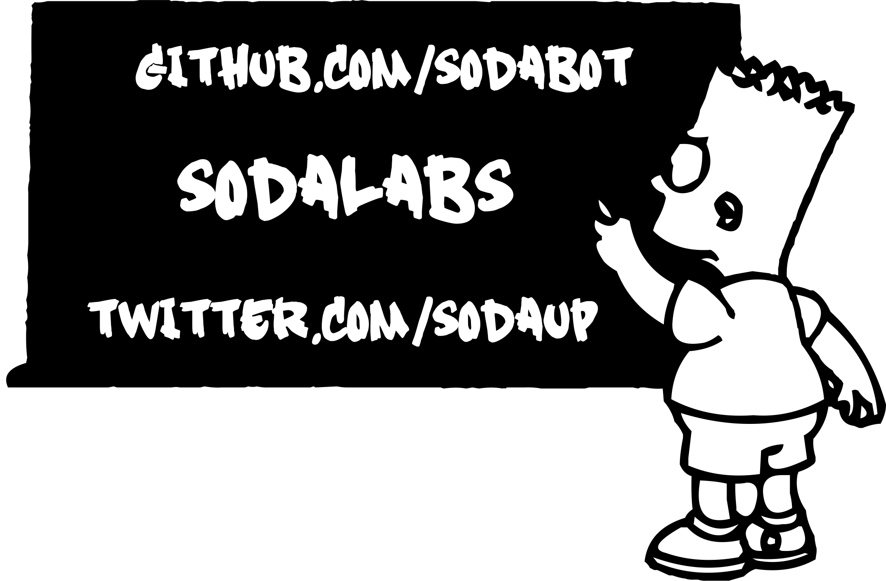

# Устройства 

## #Android, #iOs, #Linux, #MacOSX, #windows

[Apache Ripple for Chrome](https://chrome.google.com/webstore/detail/ripple-emulator-beta/geelfhphabnejjhdalkjhgipohgpdnoc)

[Размеры экранов](http://habrahabr.ru/post/169141/)

# Иконки-Шрифты 

[создание шрифта: видео](http://www.youtube.com/watch?v=_KX-e6sijGE)

[создание шрифта: пост](http://www.intridea.com/blog/2012/4/24/symbol-font)

[Создание символьного шрифта в Inkscape](http://ninniah.ru/sozdanie-simvolnogo-shrifta-v-inkscape.html)

[Как создать ttf](http://macnoob.ru/freewrite/kak-sozdat-ttf-shrift-iz-izobrageniy-fontographer/)

![printer] (Pictures/alphabet/printer.png)

![api] (Pictures/alphabet/api.png)

# [Стили](stylus)
## #css, #stylus

[yandex+stylus](http://habrahabr.ru/company/yandex/blog/169415/)

# Изображения 
## #splashscreen, #icon, #favicon

![criam] (plane.png)

# Концепты приложений

# Полезные ссылки

[Behance](https://www.behance.net/)

[Dribbble](https://dribbble.com/)

[Focuslabllc](http://focuslabllc.com/)

[Ui/Ux](http://www.kasper.by/help/chto-takoe-ux-i-ui-dizain/)

[Грань между UI и UX](http://habrahabr.ru/post/190840/)

[UX – это не UI](http://www.cmsmagazine.ru/library/items/usability/ux-is-not-ui/)

[UI vs UX: what’s the difference?](http://www.webdesignerdepot.com/2012/06/ui-vs-ux-whats-the-difference/)

